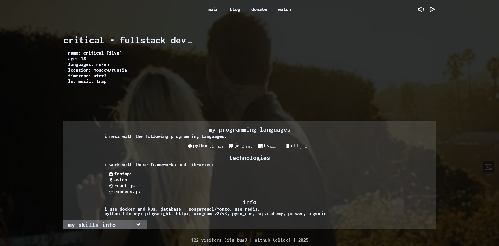

# critical.su website

[](https://critical.su)



A modern, stylish landing page for critical.su

## 🚀 Tech Stack

<div align="left">
  
  
  
</div>

## 📝 Project Overview

This repository contains the source code for the critical.su website. The site is built with modern web technologies to provide a fast, responsive user experience.

## ✨ Features

- Fast, static site generation with Astro
- Responsive design with TailwindCSS
- Interactive components powered by React
- Content management through MDX files

## 🗂️ Project Structure

```
critical.su/
├── public/           # Static assets
├── src/
│   ├── components/   # React & Astro components
│   ├── content/
│   │   └── posts/    # MDX blog posts
│   ├── layouts/      # Page layouts
│   └── pages/        # Page components
├── .env              # Environment variables
└── astro.config.mjs  # Astro configuration
```

## 🛠️ Installation

1. Clone the repository
```bash
git clone https://github.com/vmilfe/critical.su.git
cd critical.su
```

2. Install dependencies
```bash
pnpm install
```

3. Start the development server
```bash
pnpm run dev
```

## 🚧 Future Development Plans

- Enhance video and audio controller functionality
- Implement proper API for view tracking
- Configure MongoDB connection and server settings

## 📊 Content Management

Posts are stored as MDX files in the `src/content/posts` directory. Example post:

```mdx
---
id: 2
title: this fist page completed! :\\
createDate: 2025-03-05T21:31:50
postTitle: wtf, critical search a work again?
blureBackground: true
---

# My Amazing Post

This is the content of my post.
```

## 📫 Contact

<div align="left">
  <a href="https://t.me/awixa">
    
  </a>
  <a href="https://critical.su">
    
  </a>
</div>

---

<p align="center">
  Made with ♥️ by <a href="https://t.me/awixa">@awixa</a>
</p>
